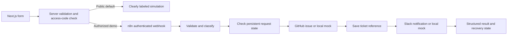

# SupportFlow: Automated IT Request Triage

[Live demo — simulation](https://supportflow-three.vercel.app/) · [Source repository](https://github.com/ahamedfoisal/supportflow) · [Verification](docs/VERIFICATION.md) · [Deployment guide](docs/DEPLOYMENT.md)

A learning/portfolio project, not production experience. GitHub Issues is a lightweight ticket stand-in, **not an ITSM platform**. No AI, access grants, identity changes, SLA engine or enterprise integration claims.

**Verification status:** Imported, published and executed in local n8n **2.41.4** against mock APIs. Validation, authentication, sequential duplicate detection, bounded retries, permanent failure, notification recovery, ambiguous timeout, classification, restart persistence and sanitized failure audit all passed. Next.js production build, seven server-route tests, four mock-service tests and actual frontend → n8n → mock API forwarding passed. The public Vercel simulation is deployed and its sample submission was verified. **GitHub/Slack live integration, Docker Compose and n8n Cloud are not tested.** See [verification](docs/VERIFICATION.md).

## Project overview



**Demonstrated locally:** sequential duplicate protection, notification recovery without another ticket, persistence after restart, bounded API retries and input/authentication failures. All integration tests used local mocks. The owner also personally confirmed the duplicate, recovery and restart checks.

## What is included

- `workflows/supportflow.json`: main workflow, local mock endpoints by default.
- `workflows/failure-audit.json`: sanitized error-context workflow.
- `docker-compose.yml`: n8n **2.41.4**, persistent named volumes, localhost bindings; Docker was unavailable on the build machine.
- `mocks/server.mjs`: tiny Node HTTP mock, with persisted tickets and controllable failures.
- `web/`: Next.js **16.3.7**, React **19.2.4**, lockfile, form and server API.
- [Learning guide, diagram and rules](docs/LEARNING.md), [recovery](docs/RECOVERY.md), [deployment](docs/DEPLOYMENT.md), [demo/interview/CV](docs/PORTFOLIO.md).

Node 24.9.0 was available and used for frontend verification. n8n stable 2.41.4 was confirmed via the official npm registry on 2026-09-30. Cloud versions are provider-managed; record the version shown by your Cloud instance and rerun verification if different.

## Three clearly separated demonstrations

| Mode | Runs n8n? | Creates external artifacts? |
|---|---|---|
| Public frontend simulation (default) | No | No; result explicitly says simulated |
| Local n8n + mock APIs | Yes, after you install/import it | Mock tickets/messages only |
| Protected frontend + real n8n workflow | Yes | GitHub issue and Slack message |

Public simulation is intentionally stateless and has no ticket link. It is a UI illustration, not proof of workflow or integration success. The protected mode forwards to whichever n8n workflow the server is configured to use; the returned `mode` distinguishes mock from real.

## Fastest start: frontend

From this project directory:

```sh
cd web
npm ci
npm run dev
```

Open http://127.0.0.1:3000. Submit the sample request. No credentials are needed for public simulation. `npm test` runs the server-route tests; `npm run build` builds for deployment.

## Local n8n and mocks

Allow several GB of free disk space before installing n8n or Docker images.

With Docker installed:

1. Copy `.env.example` to `.env`. Generate an encryption key locally with `openssl rand -hex 32` and replace the placeholder. Keep this key private and back it up; losing it can make credentials unreadable.
2. Run `docker compose up -d` and open http://localhost:5678. Create your local owner account.
3. In the **Configuration** node, change the mock URLs to `http://mock:4010/issues` and `http://mock:4010/notify`. Docker's localhost points to its own container.

Without Docker (in separate terminals):

```sh
mkdir -p .runtime
npm install --prefix .runtime n8n@2.41.4
N8N_USER_FOLDER="$PWD/.runtime/data" N8N_LISTEN_ADDRESS=127.0.0.1 N8N_CONCURRENCY_PRODUCTION_LIMIT=1 N8N_DIAGNOSTICS_ENABLED=false .runtime/node_modules/.bin/n8n start
```

```sh
node mocks/server.mjs
```

The workflow's default mock URLs are correct for this npm setup. `.runtime/data` holds persistent n8n data; `mock-state.json` holds mock data. Never commit either. Retain n8n's generated encryption configuration between restarts.

### Import and configure

1. In your n8n project, create Data Table **supportflow_requests** with two **String** columns: `request_key`, `state`. n8n supplies its system ID/timestamp columns automatically. Do not create multiple tables with this name in the same project.
2. Create Data Table **supportflow_failures**, with **String** columns: `execution_id`, `workflow_id`, `last_node`, `occurred_at`, `outcome`.
3. Import `workflows/failure-audit.json` and `workflows/supportflow.json` using the workflow menu's **Import from File**. Save both in that same project and **Publish the failure-audit workflow**. n8n 2.41.4 will not run an unpublished error workflow.
4. Create a **Header Auth** credential named **SupportFlow Webhook**. Header name: `Authorization`. Value: `Bearer ` followed by a random secret generated locally. Select it in the Request node. Placeholder credential IDs in the JSON must be rebound to your own credential.
5. Open each Data Table node and confirm it resolves the named table. If your Cloud UI requires a picker, select the matching table in every such node. The column mappings are included.
6. Main workflow → Settings → Error workflow: select **SupportFlow sanitized failure audit**. Save. Error Trigger handles unexpected production failures; normal handled API failures go into the request table.
7. Leave saved execution data disabled. The incoming webhook item contains the auth header; do not pin/export it or enable raw execution logging. Use synthetic requests only.
8. **Publish** the main workflow in n8n 2.x. The `/webhook/supportflow` production URL is available after publishing. The `/webhook-test/…` URL works only while listening in the editor and is not for Vercel.

Exercise: open the validator output in a manual, synthetic test and compare the original body with normalized fields. Do not screenshot the Request node's headers.

### Submit and verify

Read the webhook secret silently into your terminal environment (zsh):

```sh
read -s 'SUPPORTFLOW_KEY?Webhook secret: '
export SUPPORTFLOW_KEY
curl -i http://127.0.0.1:5678/webhook/supportflow \
  -H 'Content-Type: application/json' \
  -H "Authorization: Bearer $SUPPORTFLOW_KEY" \
  --data-binary @samples/valid.json
```

Expected successful shape (an example, **not recorded execution evidence**):

```json
{"request_id":"REQ-1001","priority":"P3","outcome":"completed","ticket_url":"https://mock.invalid/issues/1","mode":"mock","execution_id":"..."}
```

Repeat that command unchanged: it should return the same ticket reference without another issue or notification. Change the description while keeping the ID: expect `request_id_conflict` (409).

```sh
# Missing auth: expect 401 or 403 from n8n before execution.
curl -i http://127.0.0.1:5678/webhook/supportflow \
  -H 'Content-Type: application/json' --data-binary @samples/valid.json
# Complete local verification suite, including intentional mock failures:
node scripts/verify-n8n.mjs
# Inspect mock counts (synthetic request data):
curl http://127.0.0.1:4010/state
# Restart only; never use `down -v` when checking persistence:
docker compose restart n8n
# Then run the exact --after-restart command printed by the test script.
```

For npm mode, stop n8n and relaunch the same command with the same data folder. The script prints a `RESTART_REQUEST_ID` to reuse. Its restart phase checks that the ticket count stays unchanged.

## Connect the frontend to your local mock workflow

After the local n8n test passes, copy `web/.env.local.example` to `web/.env.local` and set:

- `N8N_WEBHOOK_URL=http://127.0.0.1:5678/webhook/supportflow`
- `N8N_WEBHOOK_SECRET` to the raw secret from your n8n credential (without the `Bearer ` prefix).
- `DEMO_ACCESS_CODE` to a separate random value of at least 16 characters.

Restart `npm run dev` from `web/`, choose **Protected n8n execution**, enter your demo code and submit. A completed local run is labeled **N8N + MOCK APIS**. The frontend never receives the n8n secret. Local HTTP forwarding is allowed only in development; use HTTPS with Cloud/Vercel.

If macOS reports `EMFILE: too many open files, watch`, stop the development server and use `WATCHPACK_POLLING=1000 npm run dev -- --webpack`. The production build does not require development file watching.

## Real integration setup

Choose your own **private test repository** and Slack test channel. Obtain explicit approval for the exact repository/channel before running real calls. This build has made none.

1. GitHub: create a fine-grained PAT restricted to that single repository, **Issues: read and write** (metadata read is implicit). Give it a short expiry. No contents, administration, identity or organization permissions are needed. Ensure Issues is enabled and comply with any organization approval policy.
2. In n8n, create Header Auth **SupportFlow GitHub**: name `Authorization`, value `Bearer YOUR_TOKEN`. Enter the token in n8n, never chat or source.
3. Slack: create/install a bot app with **chat:write**, invite it to the selected test channel, and copy that channel's `C…` ID. Membership avoids needing `chat:write.public`.
4. Create Header Auth **SupportFlow Slack**: name `Authorization`, value `Bearer YOUR_BOT_TOKEN`, entered only in n8n.
5. Generate a configured copy with no tokens:

```sh
node scripts/configure-real.mjs YOUR_OWNER/YOUR_REPO C0123456789
```

6. Import `workflows/supportflow-real.json`. Rebind the webhook credential and all three ticket HTTP nodes to the GitHub credential; all three notification HTTP nodes to the Slack credential. Select the error workflow. The same generator-built graph is reused; there is no separate real orchestration implementation.
7. Unpublish the mock workflow before publishing the real one: both intentionally use the same webhook path. State keys include the mode so mock records do not block real requests. Never point real credentials at arbitrary/mock hosts.
8. Confirm approval, publish, then run one synthetic request. Inspect the actual GitHub issue and Slack message. Record the evidence separately from mock tests.

Native HTTP Request nodes are used instead of provider-specific action nodes so response status, headers, Slack's `ok` field, and timeout ambiguity can be handled consistently in both modes. JavaScript does validation, classification and small response transformations; it does not make network calls.

## Troubleshooting and limits

- **404 webhook:** publish the workflow; check production URL and that only one workflow owns the path.
- **401/403:** check header spelling/value and credential selection. No workflow-level retry is attempted for incoming authentication errors.
- **Table missing:** same project, exact name and String columns; reselect tables in the node UI if necessary.
- **Connection refused:** npm uses `127.0.0.1:4010`; Compose uses `mock:4010`; Cloud cannot reach your laptop's localhost.
- **Partial success:** 207 / `notification_failed` means the ticket exists. Resubmit exactly the same ID/body to recover notification.
- **Timeout/409 uncertainty:** follow [recovery](docs/RECOVERY.md); never make a new ID to “fix” a timeout.
- **No visible saved executions:** intentional reduction of exposure. n8n can retain initial snapshots pending pruning; protect its database/backups. The request table captures stage, status, attempt and execution ID; the error table contains only safe context.
- **Python runner warning:** the local npm runtime may report a missing Python environment. This workflow uses JavaScript only; its JS runner was verified. Internal runners/npm hosting have deprecation notices in this version; use the pinned local setup for learning and n8n Cloud for the separate hosted deployment.
- **Disk full:** free space yourself, then reinstall; do not delete persistent volumes to solve a storage issue unless intentionally discarding data.
- Data Tables lookup/upsert is not a transaction or unique lock. Concurrent runs can both create a ticket. Local production concurrency is set to 1; manual runs and Cloud concurrency remain limitations. Demonstrate sequentially. Multi-worker exactly-once behavior would require atomic claims and stronger reconciliation.
- GitHub has no creation idempotency key used here. Ambiguous creation results require human reconciliation. Slack delivery may duplicate after an ambiguous send; ticket creation remains guarded.
- Request records include normalized synthetic email/description and a canonical payload for conflict checking. Retain deduplication records for as long as retries are allowed. Removing them permits old IDs to create tickets again.
- Frontend throttling is per-process and resets on cold starts; it is not a distributed abuse barrier. Add Vercel firewall rate limits before broad sharing. Never share the demo code publicly.

Official references and exact verification evidence: [docs/VERIFICATION.md](docs/VERIFICATION.md).
