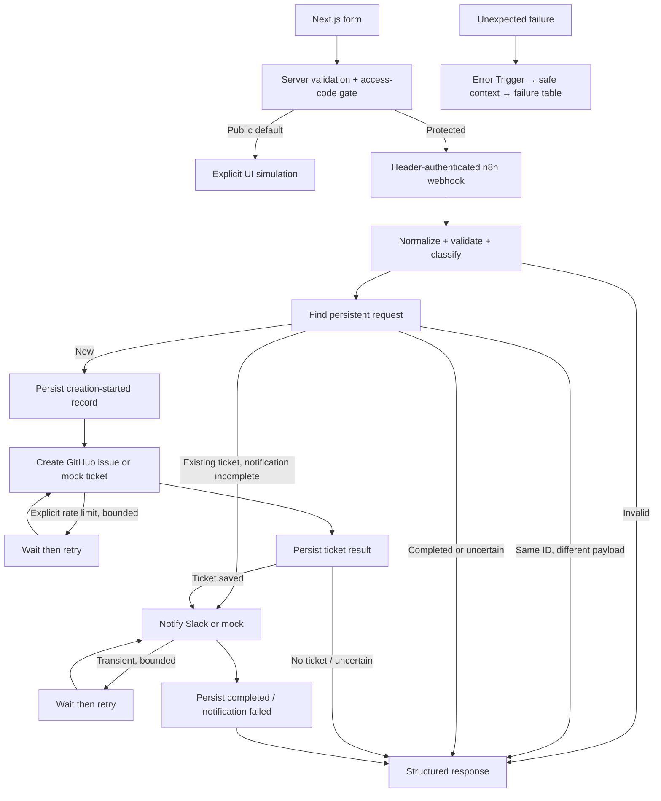

# Learning guide

## Rules: first matching priority rule wins

| Condition | Priority |
|---|---|
| Organization impact AND high urgency | P1 |
| Organization impact OR high urgency | P2 |
| Everything else | P3 |

Team impact with normal urgency is P3 in this intentionally small demo. Priority is suggested, not an SLA commitment.

| Category | Suggested team |
|---|---|
| access | Identity support |
| hardware | Endpoint support |
| software | Application support |
| network | Network support |
| other | Service desk |

No access changes are performed. Description case is preserved; whitespace is collapsed. Request IDs uppercase; email and enum fields lowercase. Email syntax validation does not prove mailbox ownership. ID: 3–64 characters, letters/digits/underscore/hyphen; email: 3–254; description: 10–2000; category/impact: 2–24; urgency: 2–16. All six fields must be strings. Unknown fields are discarded.

## Node inputs and outputs

| Node(s) | Input → output / concept |
|---|---|
| Request | POST JSON + Header Auth credential → webhook item containing `body` and headers. Authentication happens before the graph. |
| Configuration | Fixed mode, API URLs and channel → configuration item. No request may override these settings. |
| Validate and classify | `$('Request').first().json.body` → normalized request, field errors, priority, team and mode-prefixed key. The shared frontend validator is embedded by the generator. |
| Valid | Boolean expression `$json.errors.length === 0` → true or false branch. False goes to 422 response. |
| Find request | Native Data Table Get → row, or an empty item through Always Output Data. |
| Decide | Stored JSON state + current normalized payload → `create`, `notify` or `respond`. A changed payload with an old ID returns 409. |
| Create ticket / Recover notification | Native If branches route that decision; no API action lives in Code. |
| Reserve request | Upsert `request_key,state` before the external side effect. State begins `creation_uncertain` so a crash cannot silently allow another create. |
| Prepare ticket | Unpacks table state into an n8n item. |
| ticket API 1–3 | Native HTTP POST using JSON expressions → full status/headers/body, or transport error. Real mode selects a Header Auth credential. |
| Assess ticket 1–3 | Small transformation → allow rate-limit retry, save returned ticket reference, or return failure/uncertainty. No raw provider error is persisted. |
| Retry ticket 1–2 / ticket pause 1–2 | Native If + Wait → up to three total attempts; no unbounded loop. |
| Save ticket result / Read ticket result | Persist first, then unpack. The notification path cannot start before this write completes. |
| Ticket exists | Routes missing/uncertain ticket to response, known ticket to notification. |
| Prepare notification | Reset attempt count while preserving the ticket. |
| notification API / Assess / Retry / pause | Native HTTP and bounded branches. Slack success requires `ok:true`, not merely HTTP 200. Only ID, priority and ticket URL are sent as message text. |
| Save notification result / Read final state | Persist completion or partial success; retry can skip ticket creation. |
| Respond | JSON allowlist and explicit HTTP status. Does not return raw headers, email, description or provider error. |
| Unhandled failure / Safe context / Persist safe audit | Error Trigger → safe execution ID, workflow ID, last node, timestamp and fixed outcome → separate Data Table. Publish this workflow, then assign it in Settings. |

`$json` refers to the current node's input. `$('Node').first().json` reads a named upstream node. `.item` follows item linking; this graph accepts exactly one request item. Credentials are references to encrypted n8n-managed values, never exported token literals. Expressions begin `={{ ... }}` in node fields.

## Milestone exercises

1. Validation: use `" Access "` and a repeated space in the description. Inspect normalized data, not secret-bearing webhook headers.
2. Classification: change team-impact/normal requests to P2. Update both workflow rule and public simulation if you want the illustration to match. Regenerate the workflow after source edits.
3. Reliability: submit a new ID containing `SLACKFAIL`. Find the persisted ticket URL after the 207 response. Resubmit unchanged and observe notification recovery.
4. Failure handling: submit an ID containing `PERM`, inspect `stage`, `last_status`, `attempt`, `execution_id` in the request state. Explain why validation/auth errors are not retried.
5. Persistence: restart n8n, reuse a completed ID and compare mock ticket counts.

The workflow is generated by `node scripts/build-workflow.mjs`. Regeneration overwrites only its generated JSON; it does not preserve manual edits made to that file or in the n8n editor. Keep your chosen authoritative copy clear.
